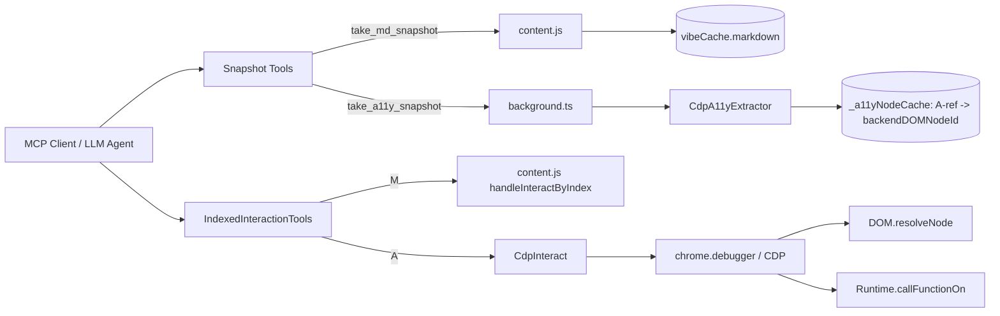
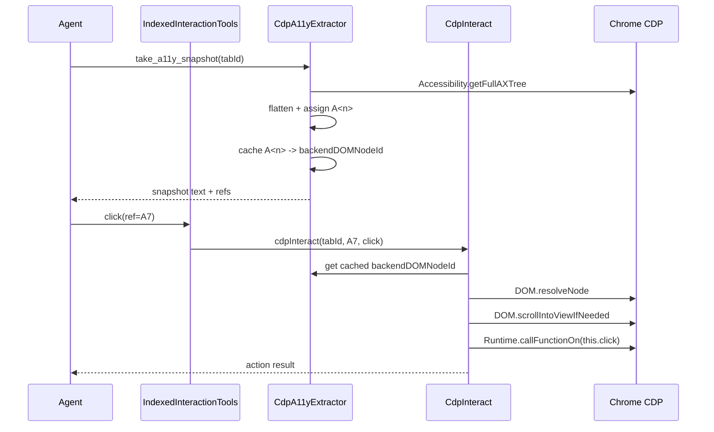

Every serious browser agent hits the same design decision: how should the model "see" a page before it clicks, types, or submits?

The two most practical answers in 2026 are:

- **Accessibility snapshots** (role/name-oriented state)
- **Markdown snapshots** (token-efficient semantic content)

At VibeBrowser we intentionally support both. Not because it looks nice in docs, but because each format solves a different reliability and cost problem in production agent loops.

This article is the full system-design, SEO, and product strategy breakdown of that decision.

## The core problem

Browser agents do not fail because they cannot call `click()`.

They fail because the model gets a poor representation of page state:

- Too verbose (token burn, context collapse)
- Too lossy (misses actionable controls)
- Too unstable (refs drift between read and act)

So the first design decision is not "which LLM?" It is "which page-state contract do we feed the LLM?"

## Two snapshot formats, two jobs

### Markdown snapshots

Markdown snapshots are optimized for **reading intent**:

- compact page structure
- lower token usage
- easier long-context reasoning for research and extraction tasks

Great for:

- summarization
- document extraction
- step planning across dense pages
- workflows where the model mostly reads, then takes a few actions

### Accessibility snapshots

A11y snapshots are optimized for **interaction intent**:

- role + accessible name alignment
- stable action references (`A<n>`)
- better mapping to buttons, inputs, comboboxes, checkboxes, tabs, menus

Great for:

- forms and widgets
- shadow DOM-heavy interfaces
- precise interaction loops (`snapshot -> click/fill/check/select`)
- deterministic tool routing

## System design: how Vibe routes both paths

Operationally:

- `M<n>` refs run through content-script DOM interaction
- `A<n>` refs run through background CDP interaction

This separation is intentional. It keeps markdown fast and lightweight while keeping a11y interactions close to CDP where they are most reliable.

## Sequence flow: A-ref click

## Why cache `A<n> -> backendDOMNodeId`?

This was a deliberate design choice and it mirrors the same pattern used by major MCP implementations:

- snapshot first
- interact by stable ref
- do not re-scan full tree for every single click

In our extension runtime, we do not have Puppeteer/Playwright object wrappers. We operate on raw CDP, so an explicit backend-node cache is the correct equivalent.

Benefits:

1. **Latency**: avoids full AX tree retrieval on each interaction.
2. **Determinism**: action targets the exact node from the captured snapshot.
3. **Reliability**: better behavior on complex UI surfaces (shadow DOM, iframes).
4. **Cleaner boundaries**: a11y lifecycle remains in background/CDP, not mixed with content-script attribute injection.

## Decision matrix: when to use what

| Task shape | Best format | Why |
| --- | --- | --- |
| Read-heavy research page | Markdown | Lower token cost and clearer long-form structure |
| Interactive signup/payment/settings form | A11y | Role/name-driven controls are easier to target safely |
| Dense enterprise dashboard with many widgets | A11y first, markdown second | Interact with A-refs, summarize with markdown |
| Multi-step extraction + occasional click | Markdown first, A11y fallback | Start cheap, escalate to A11y only when needed |

## SEO strategy: why this topic matters commercially

If you are building in AI automation, "a11y snapshot vs markdown snapshot" is not just an engineering debate. It is now a high-intent search topic because teams are actively evaluating which browser-agent stack to adopt.

### High-intent keyword clusters

- **Technical intent**
  - a11y snapshot browser automation
  - markdown snapshot ai agent
  - browser agent state representation
  - cdp accessibility getFullAXTree
- **Evaluation intent**
  - playwright mcp vs chrome devtools mcp
  - best browser mcp for ai agents
  - browser automation token efficiency
- **Product intent**
  - ai browser copilot for teams
  - secure browser agent with credentials vault

### Content positioning that converts

To rank and convert, pages in this category should include:

1. **Concrete architecture diagrams** (not vague feature lists)
2. **Failure-mode analysis** (stale refs, detached nodes, page mutation)
3. **Decision matrices** (when to use format A vs B)
4. **Clear migration guidance** (what to keep, what to refactor)

This is exactly why technical SEO and system design content now overlap. Buyers in this category are often senior engineers, not just marketing leads.

## Marketing narrative: from tools to outcomes

Most products in this space market tool breadth.

The stronger message is outcome reliability:

- "Your agent completes workflows with fewer retries."
- "Your token budget lasts longer on real pages."
- "Your team can debug action failures with deterministic refs."

That outcome-first framing is where VibeBrowser wins:

- markdown path for cost-efficient reasoning
- a11y path for interaction precision
- unified MCP surface for both
- extension-native workflows that preserve real user context

## Practical implementation checklist for teams

If you are designing your own browser-agent stack, use this order:

1. Start with a markdown state path for read-heavy tasks.
2. Add an a11y state path for interaction-critical flows.
3. Keep a stable ref contract (`A<n>`, `M<n>`) and route by prefix.
4. Cache interaction identity at snapshot time.
5. Return explicit stale-ref errors and force fresh snapshot refresh.
6. Track per-flow success rate, retries, and median action latency.

## Final takeaway

The right architecture is not **A11y vs Markdown**.

The right architecture is **A11y + Markdown with explicit routing**.

Use markdown when the model needs to understand.
Use a11y when the model needs to act.

That is the system-design pattern that scales from demos to production.

If you want the deeper comparison context, see:

- [The Great Browser MCP Showdown](/blog/mcp-browser-automation-comparison)
- [chrome-devtools-mcp vs playwright-mcp](/blog/chrome-devtools-mcp-vs-playwright-mcp)
- [Vibe MCP docs](https://www.vibebrowser.app/mcp)
